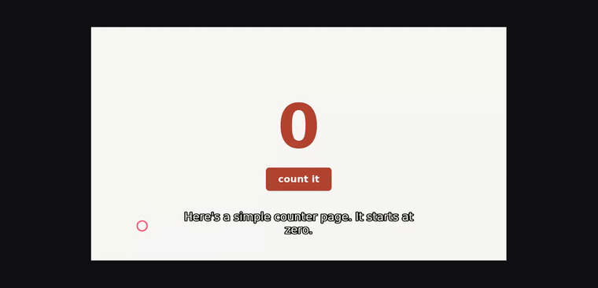

# proving-it-works

A Claude Code plugin for making a movie that proves software actually
works — and for catching the defects that make such movies worthless
before you hand one to anybody.

## See it work



**▶ [Watch the full two minutes, with sound](https://github.com/prime-radiant-inc/proving-it-works/raw/main/docs/demo.mp4)**
 · [subtitles](docs/demo.srt) · [how it was made](examples/e2e/)

A clean container installs this plugin from the public marketplace, an agent
inside it uses the skill to make a narrated movie of a small web app, and the
skill's own checker verifies that movie. The loop above is that inner movie
playing: real screenshots, a cursor you can watch, a local voice (there is no
API key in that container), and subtitles burned into the picture.

## Why

A movie is evidence, and every way it fails is silent. No crash, no red
text: just an artifact that looks fine to whoever made it and is obviously
broken to the first person who watches it.

This plugin exists because of a measured failure. Two agents were asked to
record a narrated movie proving a small web app worked. One of them
extracted frames and looked at them, ran `ffprobe`, checked the audio wasn't
silent, asserted real DOM state at every step, and confirmed via the server
log that a page reload had genuinely round-tripped. Every check passed. It
shipped a movie whose picture froze three seconds in while the narration
kept talking for another twenty.

Per-frame verification cannot see a defect that lives *between* frames. So
the timeline check here is a script, not advice.

## What's in it

A skill, `proving-it-works-with-a-movie`, that covers five routes:

| Route | For |
|---|---|
| Browser-driven motion | The interaction is the claim: typing, clicking, live updates |
| Desktop window | A desktop app's window, captured with ffmpeg (recording-motion.md) |
| Terminal | A CLI, a TUI, an install, a test run, an agent working |
| Stills | A sequence of real states, motion optional |
| Log-rendered reel | OS capture is blocked, or the thing to prove is a *run*, not a UI |

...plus the parts that go wrong regardless of route: narration verbatim
gates, measured (never guessed) pacing, cursor visibility, ffmpeg traps, and
recording against a copy of your data rather than the real thing.

### The tool

One binary, `bin/movie`, prebuilt for macOS, Linux, and Windows. It needs
ffmpeg; `movie term` also needs tmux, and the keyless local voice needs
Piper (see Requirements):

| Command | Does |
|---|---|
| `movie build scenes.yaml movie.mp4` | narrates (a cloud voice with a key, a local one without), assembles each scene to max(narration, visuals), writes and burns subtitles, and runs the gate |
| `movie check movie.mp4` | the gate, alone |
| `movie term ...` | films a terminal session into frames |

### `movie check`

The mechanical gate. It samples picture and sound on one timeline and fails
a movie when the action is crammed into the opening seconds while narration
continues over a frozen picture, when the picture never changes at all, or
when the audio is silent. It writes a contact sheet you are then expected to
actually look at.

```
$ skills/proving-it-works-with-a-movie/bin/movie check demo.mp4
container  h264 1280x800, 26.8s, audio=yes
picture    reaches a new state in 2 of 26 seconds; last at 3s
sound      audible in 24 of 24 seconds; last at 23s
sheet      demo-check/contact-sheet.png
FAIL       every visible change happens in the first 3s (12% of runtime),
           then the picture is frozen for 23s while narration keeps talking
           for 20s of it. The demo is over before the explanation starts:
           pace the action to the narration.

NOT SHIPPABLE. Fix, regenerate, re-run.
```

It cannot tell you a movie is *right* — only that it isn't obviously broken.
That is what the contact sheet and your own eyes are for.

## Install

```
/plugin marketplace add prime-radiant-inc/proving-it-works
/plugin install proving-it-works
```

The skill then activates on its own when you ask for a demo, screencast,
tutorial, or proof video.

It runs on every harness below; each one reads the same skill from `skills/`.

<!-- everyharness:install:start -->

| Harness | Install |
|---|---|
| Claude Code | see docs/install/claude-code.md |
| Cursor | see docs/install/cursor.md |
| Codex | see docs/install/codex.md |
| Devin CLI | see docs/install/devin.md |
| Kimi Code | see docs/install/kimi.md |
| Gemini CLI | see docs/install/gemini.md |
| OpenCode | see docs/install/opencode.md |
| Pi | see docs/install/pi.md |
| Hermes Agent | see docs/install/hermes.md |
| Agent Plugins 1.0 clients | see docs/install/agent-plugins-1.0.md |
| Factory Droid / Grok / Copilot (marketplace descriptor) | see docs/install/agents-marketplace.md |

<!-- everyharness:install:end -->

## Requirements

- `ffmpeg` and `ffprobe`
- For the keyless voice: Piper (`uv tool install piper-tts`), see the skill's `narrating.md`
- For the browser routes: Chrome plus a driver (Playwright or raw CDP)
- tmux, for filming terminals

## Tests

```
go test ./...
```

Synthesizes movies with known defects via ffmpeg's lavfi sources and asserts
each verdict, builds real movies at awkward paths, and drives real tmux
sessions.

## Credits

The stills and log-rendered-reel routes are adapted from
`rendering-a-demo-movie.md` and `recording-a-proof-movie.md` in
[obra/superpowers](https://github.com/obra/superpowers) PR #1931 (MIT).
The rest comes from producing a real narrated product tutorial and from the
baseline experiments described above.

## License

MIT — see [LICENSE](LICENSE).
